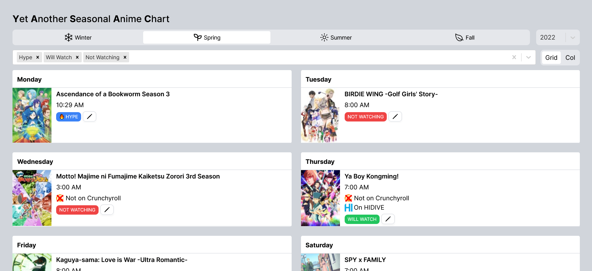

# [YASAC: Yet Another Seasonal Anime Chart](https://yasac.armaan.cc)

## ❓ Why make yet another?
There's nothing wrong with another websites like AniChart,
but my personal problem with them was I wanted to organize and emphasize certain data (such as whether the show would be on Crunchyroll, what day and time it airs, etc.)

In short, this is an anime chart designed for myself, by myself (although if you like to use it too feel free!)

Another fun fact: YASAC uses the same API as AniChart does.